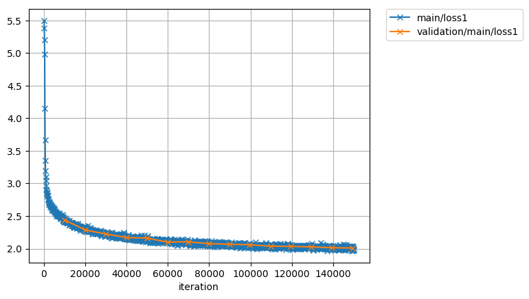

# chainer-VQ-VAE
A Chainer implementation of VQ-VAE( https://arxiv.org/abs/1711.00937 ).

# Results
Trained about 63 hours with one 1080Ti (150000 iterations) on VCTK-Corpus. You can download pretrained model from [here](https://drive.google.com/open?id=1Ayy9NbpBoZCj1WVmwHGnUTG_jB2eonVU).

Losses:




Audios:

[demo](https://nana-music.com/playlists/2276008/)

# Requirements
I trained and generated with

- python(3.5.2)
- chainer(4.0.0b3)
- librosa(0.5.1)

And now you can try it on Google Colaboratory. You don't need install chainer/librosa in your local or buy GPUs. Check [this](Colaboratory/README.md).
# Usage
## download dataset
You can download VCTK-Corpus(en) from [here](http://homepages.inf.ed.ac.uk/jyamagis/page3/page58/page58.html). And you can download CMU-ARCTIC(en)/voice-statistics-corpus(ja) very easily via [my repository](https://github.com/dhgrs/download_dataset).

## set parameters
### parameters of training
- batchsize
    - Batch size.
- lr
    - Learning rate.
- ema_mu
    - Rate of exponential moving average. If this is greater than 1 doesn't apply.
- trigger
    - How many times you update the model. You can set this parameter like as (`<int>`, 'iteration') or (`<int>`, 'epoch')
- evaluate_interval
    - The interval that you evaluate validation dataset. You can set this parameter like as trigger.
- snapshot_interval
    - The interval that you save snapshot. You can set this parameter like as trigger.
- report_interval
    - The interval that you write log of loss. You can set this parameter like as trigger.

### parameters of dataset
- root
    - The root directory of training dataset.
- dataset
    - The architecture of the directory of training dataset. Now this parameter supports `VCTK`, `ARCTIC` and 'vs'.
- split_seed
    - A seed for splitting dataset into train and validation.

### parameters of preprocessing
- sr
    - Sampling rate. If it's different from input file, be resampled by librosa.
- res_type
    - The resampling algorithm used in librosa.
- top_db
    - The threshold db for triming silence.
- input_dim
    - The input channels of wave. If it is `1`, mu-law is not applied. Else mu-law is applied.
- quantize
    - The number for quantize.
- length
    - How many samples used for training.
- use_logistic
    - Use mixture of logistics or not.

### parameters of VQ
- d
    - The parameter `d` in the paper.
- k
    - The parameter `k` in the paper.

### parameters of Decoder(WaveNet)
- n_loop
    - If you want to make network like dilations [1, 2, 4, 1, 2, 4] set `n_loop` as `2`.
- n_layer
    - If you want to make network like dilations [1, 2, 4, 1, 2, 4] set `n_layer` as `3`.
- filter_size
    - The filter size of each dilated convolution.
- residual_channels
    - The number of input/output channels of residual blocks.
- dilated_channels
    - The number of output channels of causal dilated convolution layers. This is splited into tanh and sigmoid so the number of hidden units is half of this number.
- skip_channels
    - The number of channels of skip connections and last projection layer.
- n_mixture
    - The number of logistic distribution. It is used only `use_logistic` is `True`.
- log_scale_min
    - The number for stability. It is used only `use_logistic` is `True`.
- global_condition_dim
    - The dimension of speaker embeded-vector.
- local_condition_dim
    - The dimension of local contioning vectors.
- dropout_zero_rate
    - The rate of `0` in dropout. If `0` doesn't apply dropout.

### parameters of losses
- beta
    - The parameter `beta` in the paper.

### parameters of losses
- use_ema
    - If `True` use the value of exponential moving average.
- apply_dropout
    - If `True` apply dropout.


## training
```
(without GPU)
python train.py

(with GPU #n)
python train.py -g n
```

If you want to use multi GPUs, you can add IDs like below.
```
python train.py -g 0 1 2
```

You can resume snapshot and restart training like below.
```
python train.py -r snapshot_iter_100000
```
Other arguments `-f` and `-p` are parameters for multiprocess in preprocessing. `-f` means the number of prefetch and `-p` means the number of processes.

## generating
```
python generate.py -i <input file> -o <output file> -m <trained model> -s <speaker>
```

If you don't set `-o`, default file name `result.wav` is used. If you don't set `-s`, the speaker is same as input file that got from filepath.

# TODO
- [x] upload generated sample
- [x] using GPU fot generating
- [x] descritized mixture of logistics
- [ ] Parallel WaveNet